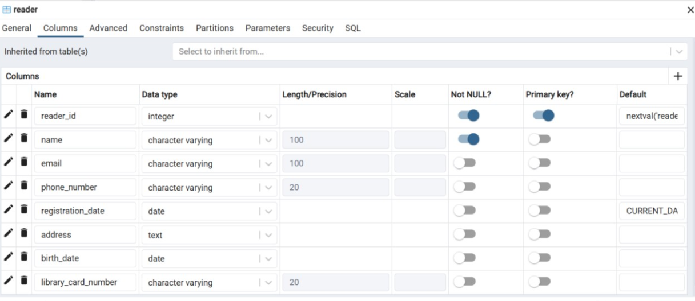
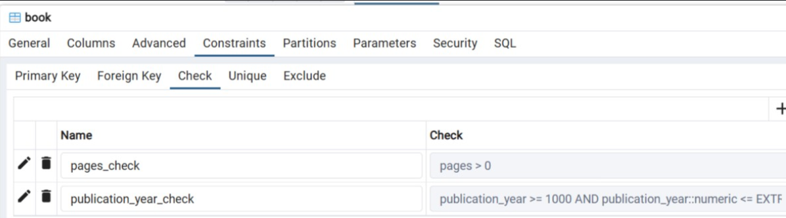
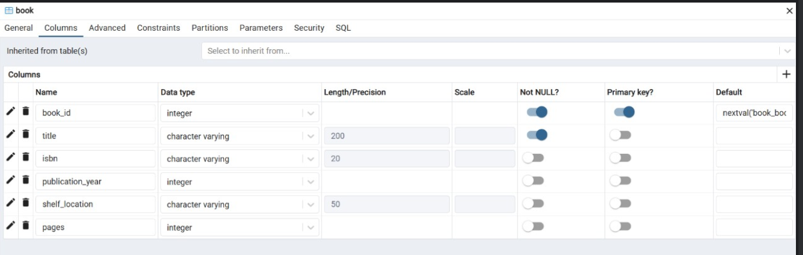
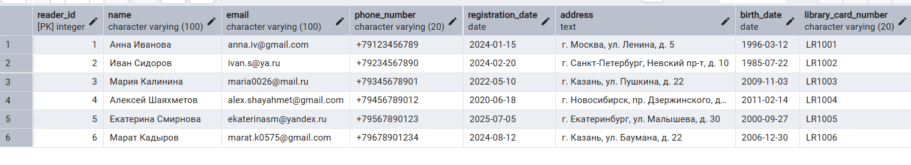
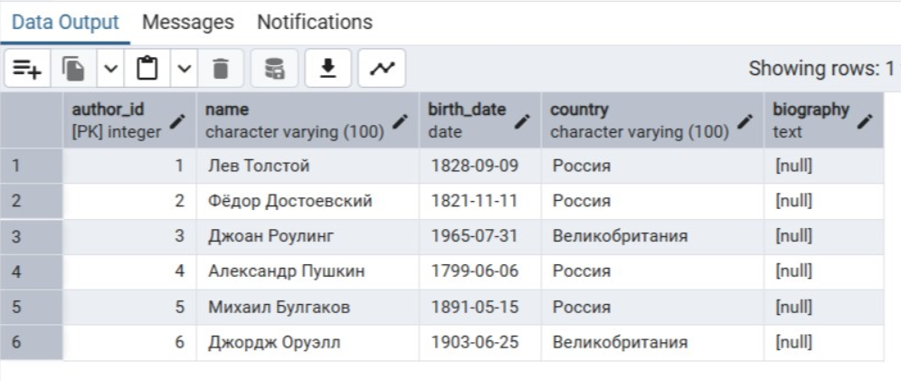
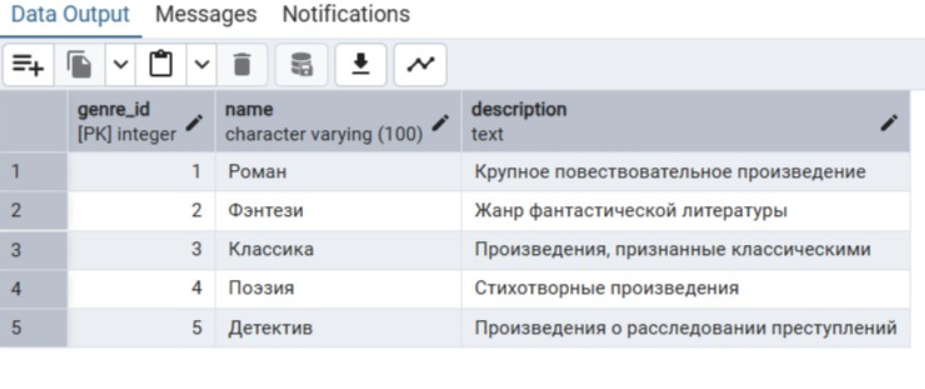
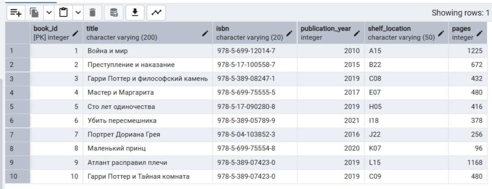
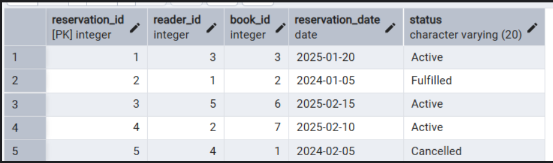
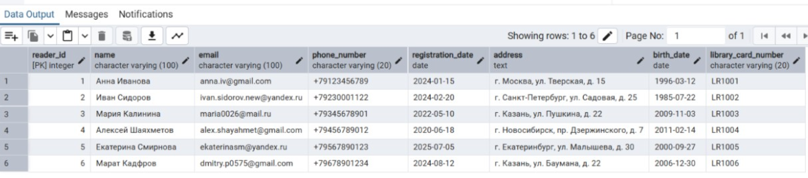
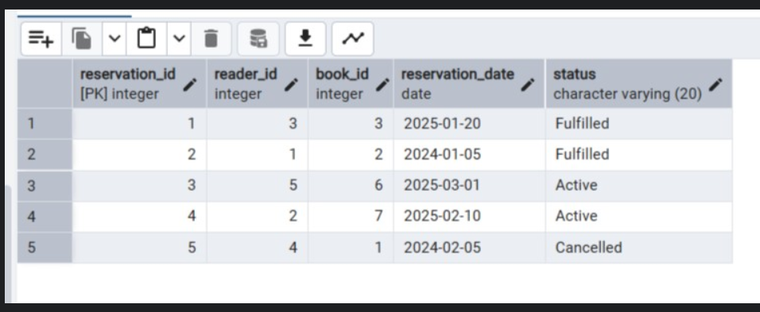

CREATE TABLE Publisher (
publisher_id SERIAL PRIMARY KEY,
name VARCHAR(100) NOT NULL,
address TEXT
);

CREATE TABLE Author (
author_id SERIAL PRIMARY KEY,
name VARCHAR(100) NOT NULL,
birth_date DATE,
country VARCHAR(100),
biography TEXT
);

CREATE TABLE Genre(
genre_id SERIAL PRIMARY KEY,
name VARCHAR(100) NOT NULL,
description TEXT
);

CREATE TABLE Reader (
reader_id SERIAL PRIMARY KEY,
name VARCHAR(100) NOT NULL,
email VARCHAR(100) UNIQUE,
phone_number VARCHAR(20),
registration_date DATE DEFAULT CURRENT_DATE,
address TEXT
);

CREATE TABLE Book (
book_id SERIAL PRIMARY KEY,
title VARCHAR(200) NOT NULL,
isbn VARCHAR(20),
publication_year INTEGER,
shelf_location VARCHAR(50)
publisher_id INT REFERENCES Publisher(publisher_id)
);

CREATE TABLE BookCopy (
copy_id SERIAL PRIMARY KEY,
book_id INTEGER REFERENCES Book(book_id),
status VARCHAR(20) CHECK (status IN ('Available', 'Borrowed', 'Under Maintenance'))
);

CREATE TABLE Loan (
loan_id SERIAL PRIMARY KEY,
reader_id INTEGER REFERENCES Reader(reader_id),
copy_id INTEGER REFERENCES BookCopy(copy_id),
loan_date DATE DEFAULT CURRENT_DATE,
due_date DATE,
return_date DATE
);

CREATE TABLE Reservation (
reservation_id SERIAL PRIMARY KEY,
reader_id INTEGER REFERENCES Reader(reader_id),
book_id INTEGER REFERENCES Book(book_id),
reservation_date DATE DEFAULT CURRENT_DATE,
status VARCHAR(20) CHECK (status IN ('Active', 'Fulfilled', 'Cancelled'))
);

CREATE TABLE Review (
review_id SERIAL PRIMARY KEY,
reader_id INTEGER REFERENCES Reader(reader_id),
book_id INTEGER REFERENCES Book(book_id),
rating INTEGER CHECK (rating >= 1 AND rating <= 5),
comment TEXT,
review_date DATE DEFAULT CURRENT_DATE
);

CREATE TABLE Fine (
fine_id SERIAL PRIMARY KEY,
reader_id INTEGER REFERENCES Reader(reader_id),
loan_id INTEGER REFERENCES Loan(loan_id),
amount DECIMAL(10,2),
issue_date DATE DEFAULT CURRENT_DATE,
status VARCHAR(20) CHECK (status IN ('Unpaid', 'Paid'))
);

--ALTER - запросы

--добавляем количество страниц
ALTER TABLE Book ADD COLUMN pages INTEGER;

--ограничение на количество страниц, не может быть меньше 1
ALTER TABLE Book ADD CONSTRAINT pages_check CHECK (pages > 0);

--добавляем дату рождения читателя
ALTER TABLE Reader ADD COLUMN birth_date DATE;

--добавляем номер читательского билета
ALTER TABLE Reader ADD COLUMN library_card_number VARCHAR(20) UNIQUE;

--ограничение на дату публикации
ALTER TABLE Book ADD CONSTRAINT publication_year_check
CHECK (publication_year >= 1000 AND publication_year <= EXTRACT(YEAR FROM CURRENT_DATE));

-- INSERT

INSERT INTO Reader (name, email, phone_number, registration_date, address, birth_date, library_card_number)
VALUES
('Анна Иванова', 'anna.iv@gmail.com', '+79123456789', '2024-01-15', 'г. Москва, ул. Ленина, д. 5', '1996-03-12', 'LR1001'),
('Иван Сидоров', 'ivan.s@ya.ru', '+79234567890', '2024-02-20', 'г. Санкт-Петербург, Невский пр-т, д. 10', '1985-07-22', 'LR1002'),
('Мария Калинина', 'maria0026@mail.ru', '+79345678901', '2022-05-10', 'г. Казань, ул. Пушкина, д. 22', '2009-11-03', 'LR1003'),
('Алексей Шаяхметов', 'alex.shayahmet@gmail.com', '+79456789012', '2020-06-18', 'г. Новосибирск, пр. Дзержинского, д. 7', '2011-02-14', 'LR1004'),
('Екатерина Смирнова', 'ekaterinasm@yandex.ru', '+79567890123', '2025-07-05', 'г. Екатеринбург, ул. Малышева, д. 30', '2000-09-27', 'LR1005'),
('Марат Кадыров', 'marat.k0575@gmail.com', '+79678901234', '2024-08-12', 'г. Казань, ул. Баумана, д. 22', '2006-12-30', 'LR1006');

INSERT INTO Author (name, birth_date, country)
VALUES
('Лев Толстой', '1828-09-09', 'Россия'),
('Фёдор Достоевский', '1821-11-11', 'Россия'),
('Джоан Роулинг', '1965-07-31', 'Великобритания'),
('Александр Пушкин', '1799-06-06', 'Россия'),
('Михаил Булгаков', '1891-05-15', 'Россия'),
('Джордж Оруэлл', '1903-06-25', 'Великобритания');

INSERT INTO Genre (name, description)
VALUES
('Роман', 'Крупное повествовательное произведение'),
('Фэнтези', 'Жанр фантастической литературы'),
('Классика', 'Произведения, признанные классическими'),
('Поэзия', 'Стихотворные произведения'),
('Детектив', 'Произведения о расследовании преступлений');

INSERT INTO Book (title, isbn, publication_year, shelf_location, pages)
VALUES
('Война и мир', '978-5-699-12014-7', 2010, 'A15', 1225),
('Преступление и наказание', '978-5-17-100558-7', 2015, 'B22', 672),
('Гарри Поттер и философский камень', '978-5-389-08247-1', 2019, 'C08', 432),
('Мастер и Маргарита', '978-5-699-75555-5', 2017, 'E07', 480),
('Сто лет одиночества', '978-5-17-090280-8', 2019, 'H05', 416),
('Убить пересмешника', '978-5-389-05789-9', 2021, 'I18', 378),
('Портрет Дориана Грея', '978-5-04-103852-3', 2016, 'J22', 256),
('Маленький принц', '978-5-699-75554-8', 2020, 'K07', 96),
('Атлант расправил плечи', '978-5-389-07423-0', 2019, 'L15', 1168),
('Гарри Поттер и Тайная комната', '978-5-389-07423-0', 2019, 'C09', 480);

INSERT INTO Reservation (reader_id, book_id, reservation_date, status)
VALUES
(3, 3, '2025-01-20', 'Active'),
(1, 2, '2024-01-05', 'Fulfilled'),
(5, 6, '2025-02-15', 'Active'),
(2, 7, '2025-02-10', 'Active'),
(4, 1, '2024-02-05', 'Cancelled');

--UPDATE - запросы

UPDATE Reader SET
email = 'ivan.sidorov.new@yandex.ru',
phone_number = '+79230001122',
address = 'г. Санкт-Петербург, ул. Садовая, д. 25'
WHERE reader_id = 2;

UPDATE Reader SET address = 'г. Москва, ул. Тверская, д. 15' WHERE reader_id = 1;

UPDATE Reservation SET
status = 'Fulfilled'
WHERE reader_id = 3 AND book_id = 3;

UPDATE Reservation SET
reservation_date = '2025-03-01'
WHERE reader_id = 5 AND book_id = 6;
