a) 
//COUNT()
1. Сколько читателей зарегистрировано?

SELECT COUNT(*) AS количество_читателей
FROM Reader;

[2025-12-02 20:20:18] 1 row retrieved starting from 1 in 363 ms (execution: 7 ms, fetching: 356 ms)

2. Сколько книг издано после 2015 года?

SELECT COUNT(*) AS книги_после_2015
FROM Book
WHERE publication_year > 2015;

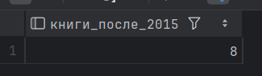

[2025-12-02 20:21:14] 1 row retrieved starting from 1 in 155 ms (execution: 3 ms, fetching: 152 ms)

//SUM()
1. Общая сумма всех штрафов

SELECT SUM(amount) AS общая_сумма_штрафов
FROM Fine;

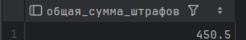

[2025-12-02 20:24:00] 1 row retrieved starting from 1 in 118 ms (execution: 14 ms, fetching: 104 ms)

2. Общее количество страниц во всех книгах

SELECT SUM(pages) AS общее_количество_страниц
FROM Book;

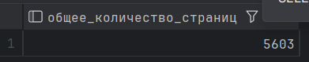

[2025-12-02 20:24:47] 1 row retrieved starting from 1 in 72 ms (execution: 4 ms, fetching: 68 ms)

//AVG()
1. Средняя оценка книг по отзывам

SELECT AVG(rating) AS средняя_оценка
FROM Review;

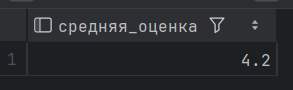

[2025-12-02 20:30:27] 1 row retrieved starting from 1 in 337 ms (execution: 17 ms, fetching: 320 ms)

2. Средний год издания книг

SELECT AVG(publication_year) AS средний_год_издания
FROM Book;

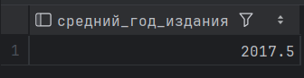

[2025-12-02 20:31:14] 1 row retrieved starting from 1 in 278 ms (execution: 4 ms, fetching: 274 ms)

//MIN() и MAX()

1. Самая старая и самая новая книга

SELECT
MIN(publication_year) AS самый_ранний_год,
MAX(publication_year) AS самый_поздний_год
FROM Book;

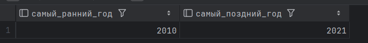

[2025-12-02 20:39:02] 1 row retrieved starting from 1 in 184 ms (execution: 14 ms, fetching: 170 ms)

2. Минимальный и максимальный штраф

SELECT
MIN(amount) AS минимальный_штраф,
MAX(amount) AS максимальный_штраф
FROM Fine;

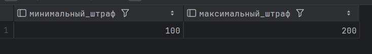

[2025-12-02 20:40:28] 1 row retrieved starting from 1 in 181 ms (execution: 7 ms, fetching: 174 ms)

//STRING_AGG()
1. Все жанры через запятую

SELECT STRING_AGG(name, ', ') AS все_жанры
FROM Genre;

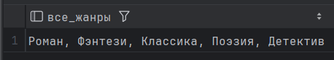

[2025-12-02 20:41:39] 1 row retrieved starting from 1 in 306 ms (execution: 14 ms, fetching: 292 ms)

2. Имена всех авторов через точку с запятой

SELECT STRING_AGG(name, '; ') AS все_авторы
FROM Author;

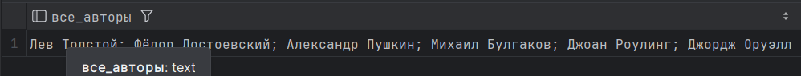

[2025-12-02 20:42:49] 1 row retrieved starting from 1 in 331 ms (execution: 4 ms, fetching: 327 ms)

b.
//GROUP BY, HAVING
GROUP BY
1. Количество книг каждого автора

SELECT
a.name AS автор,
COUNT(ba.book_id) AS количество_книг
FROM Author a
LEFT JOIN BookAuthor ba ON a.author_id = ba.author_id
GROUP BY a.name
ORDER BY количество_книг DESC;

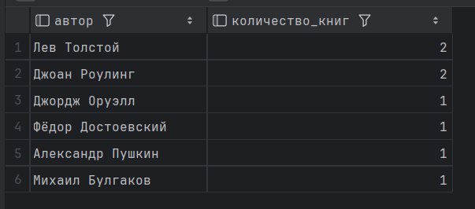

[2025-12-02 20:45:18] 6 rows retrieved starting from 1 in 280 ms (execution: 11 ms, fetching: 269 ms)

2. Количество отзывов на каждую книгу

SELECT
b.title AS книга,
COUNT(r.review_id) AS количество_отзывов
FROM Book b
LEFT JOIN Review r ON b.book_id = r.book_id
GROUP BY b.title
ORDER BY количество_отзывов DESC;

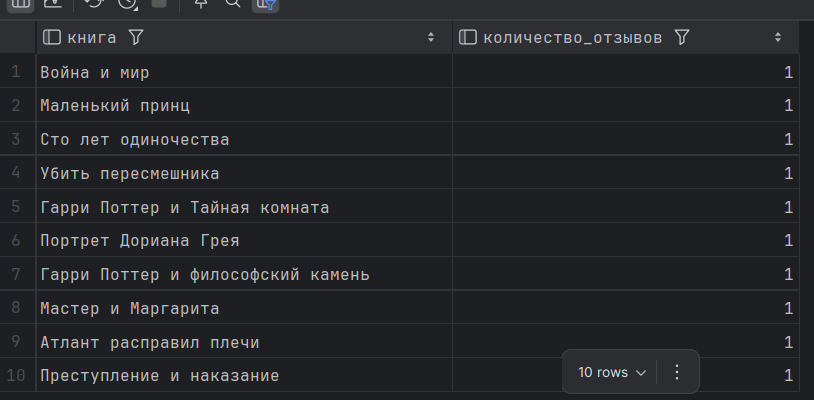

[2025-12-02 20:47:22] 10 rows retrieved starting from 1 in 244 ms (execution: 6 ms, fetching: 238 ms)

//HAVING
1. Книги с более чем 1 отзывом или 1 отзывом

SELECT
b.title AS книга,
COUNT(r.review_id) AS количество_отзывов
FROM Book b
JOIN Review r ON b.book_id = r.book_id
GROUP BY b.title
HAVING COUNT(r.review_id) >= 1;

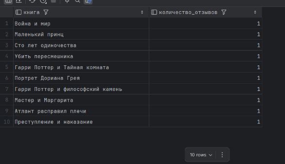

[2025-12-02 20:53:39] 10 rows retrieved starting from 1 in 244 ms (execution: 5 ms, fetching: 239 ms)

2. Читатели, которые брали более 1 книги

SELECT
r.name AS читатель,
COUNT(l.loan_id) AS количество_выдач
FROM Reader r
JOIN Loan l ON r.reader_id = l.reader_id
GROUP BY r.name
HAVING COUNT(l.loan_id) > 1;

[2025-12-02 20:54:54] 0 rows retrieved in 87 ms (execution: 5 ms, fetching: 82 ms)

//GROUPING SETS

1. Книги по жанрам и годам

SELECT
g.name AS жанр,
b.publication_year AS год,
COUNT(*) AS количество_книг
FROM Book b
JOIN BookGenre bg ON b.book_id = bg.book_id
JOIN Genre g ON bg.genre_id = g.genre_id
GROUP BY
GROUPING SETS ((g.name, b.publication_year),(g.name),(b.publication_year),()                              
);

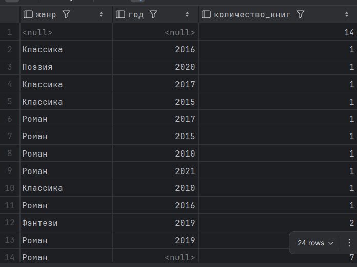

[2025-12-02 21:10:04] 24 rows retrieved starting from 1 in 156 ms (execution: 6 ms, fetching: 150 ms)

2. Книги по издателям и годам

SELECT
p.name AS издатель,
b.publication_year AS год,
COUNT(*) AS количество_книг
FROM Book b
JOIN Publisher p ON b.publisher_id = p.publisher_id
GROUP BY
GROUPING SETS (
(p.name, b.publication_year),(p.name),(b.publication_year),()                             
);

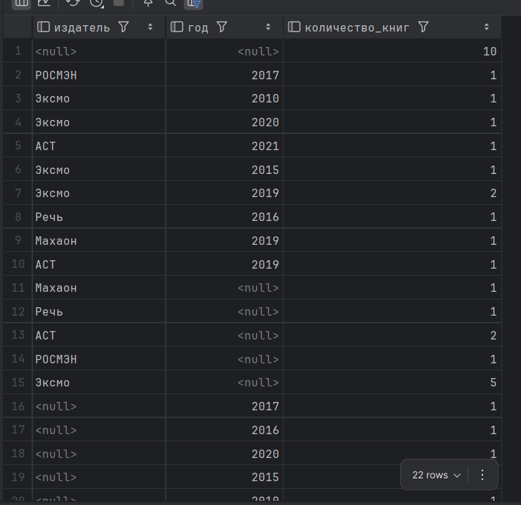

[2025-12-02 21:13:50] 22 rows retrieved starting from 1 in 265 ms (execution: 7 ms, fetching: 258 ms)

//ROLLUP

1. Штрафы по читателям и статусам

SELECT
r.name AS читатель,
f.status AS статус_штрафа,
SUM(f.amount) AS сумма_штрафов
FROM Fine f
JOIN Reader r ON f.reader_id = r.reader_id
GROUP BY
ROLLUP (r.name, f.status);

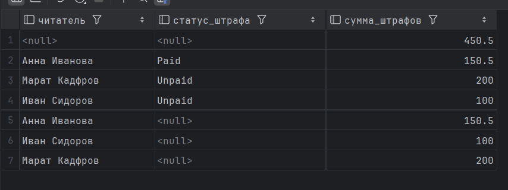

[2025-12-02 21:25:30] 7 rows retrieved starting from 1 in 266 ms (execution: 6 ms, fetching: 260 ms)

2. Бронирование по читателям и годам

SELECT
r.name AS читатель,
EXTRACT(YEAR FROM res.reservation_date) AS год,
COUNT(*) AS количество_бронирований
FROM Reservation res
JOIN Reader r ON res.reader_id = r.reader_id
GROUP BY
ROLLUP (r.name, EXTRACT(YEAR FROM res.reservation_date));

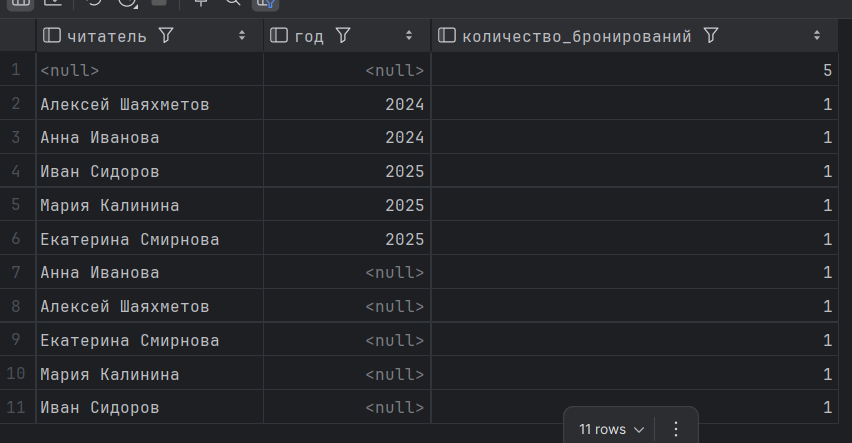

[2025-12-02 21:27:08] 11 rows retrieved starting from 1 in 98 ms (execution: 6 ms, fetching: 92 ms)

//CUBE

1. Бронирование по статусам и месяцам

SELECT
res.status AS статус_брони,
TO_CHAR(res.reservation_date, 'Month') AS месяц,
COUNT(*) AS количество_бронирований
FROM Reservation res
GROUP BY
CUBE (res.status, TO_CHAR(res.reservation_date, 'Month'));

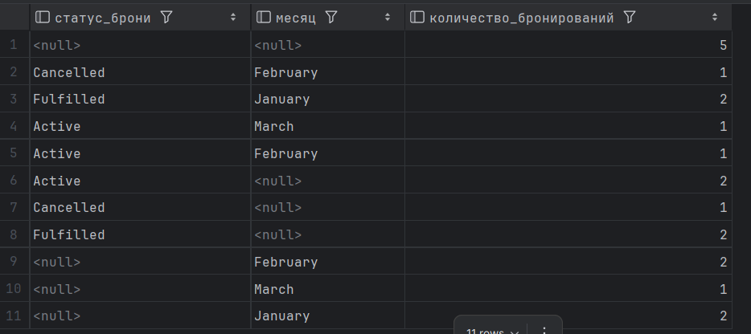

[2025-12-02 21:59:19] 11 rows retrieved starting from 1 in 281 ms (execution: 17 ms, fetching: 264 ms)

2. Книги по издателям и годам

SELECT
p.name AS издатель,
b.publication_year AS год,
COUNT(*) AS количество_книг
FROM Book b
JOIN Publisher p ON b.publisher_id = p.publisher_id
GROUP BY CUBE (p.name, b.publication_year);

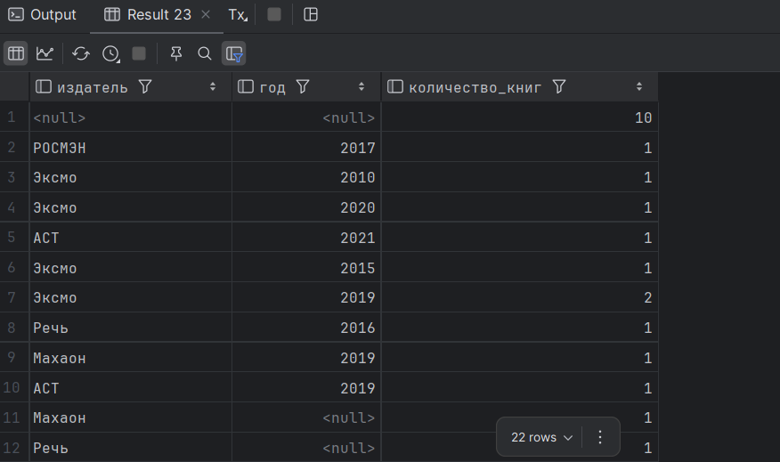

[2025-12-02 22:02:58] 22 rows retrieved starting from 1 in 260 ms (execution: 6 ms, fetching: 254 ms)

d) //SELECT, FROM, WHERE, GROUP BY, HAVING, ORDER BY

1. Книги с отзывами выше средней оценки и годом публикации после 2010 года

SELECT
b.title AS книга,
AVG(r.rating) AS средняя_оценка_книги,
COUNT(*) AS количество_отзывов
FROM Book b
JOIN Review r ON b.book_id = r.book_id
WHERE b.publication_year > 2010
GROUP BY b.title
HAVING AVG(r.rating) > (
SELECT AVG(rating)
FROM Review
)
ORDER BY средняя_оценка_книги DESC;

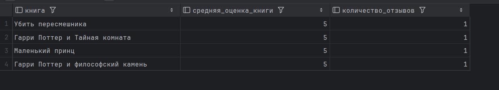

[2025-12-02 22:09:31] 4 rows retrieved starting from 1 in 145 ms (execution: 6 ms, fetching: 139 ms)

2. Авторы, у которых больше 1 книги

SELECT
a.name AS автор,
COUNT(*) AS сколько_книг
FROM Author a
JOIN BookAuthor ba ON a.author_id = ba.author_id
GROUP BY a.name
HAVING COUNT(*) > 1
ORDER BY сколько_книг DESC;

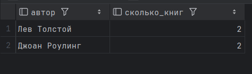

[2025-12-02 22:12:10] 2 rows retrieved starting from 1 in 298 ms (execution: 9 ms, fetching: 289 ms)
