a)**SELECT + 2 запроса с CASE**

1 - Категоризация книг по году издания
SELECT
title,
publication_year,
CASE
WHEN publication_year >= 2020 THEN 'Новые книги'
WHEN publication_year >= 2015 THEN 'Современные книги'
WHEN publication_year >= 2000 THEN 'Книги 2000-х'
ELSE 'Старые книги'
END AS age_category
FROM Book
ORDER BY publication_year DESC;

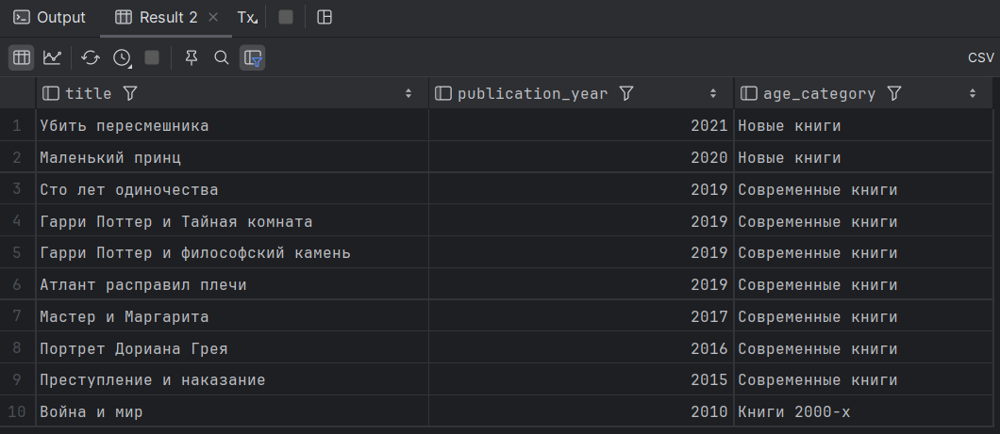

[2025-12-02 18:17:40] 10 rows retrieved starting from 1 in 270 ms (execution: 29 ms, fetching: 241 ms)

2 - Статус читателей по дате регистрации
SELECT
name,
registration_date,
CASE
WHEN registration_date >= CURRENT_DATE - INTERVAL '1 year'
THEN 'Новый читатель'
WHEN registration_date >= CURRENT_DATE - INTERVAL '3 years'
THEN 'Постоянный читатель'
ELSE 'Давний читатель'
END AS reader_type
FROM Reader
ORDER BY registration_date DESC;

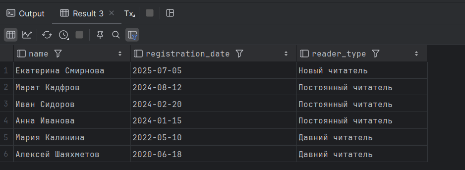

[2025-12-02 18:25:22] 6 rows retrieved starting from 1 in 194 ms (execution: 14 ms, fetching: 180 ms)

b) JOIN (Все виды – INNER, LEFT, RIGHT, CROSS, OUTER)

**INNER JOIN:**

1 - Информация о резервациях: читатель + книга + дата
SELECT
r.name AS читатель,
b.title AS книга,
res.reservation_date AS дата_резервации
FROM Reservation res
INNER JOIN Reader r ON res.reader_id = r.reader_id
INNER JOIN Book b ON res.book_id = b.book_id
ORDER BY res.reservation_date;

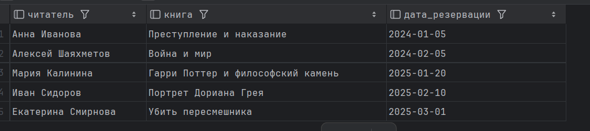

[2025-12-02 18:34:48] 5 rows retrieved starting from 1 in 408 ms (execution: 13 ms, fetching: 395 ms)

2 - Читатели, которые делали резервации:
SELECT DISTINCT
r.name AS читатель,
r.email AS email
FROM Reservation res
INNER JOIN Reader r ON res.reader_id = r.reader_id
ORDER BY r.name;

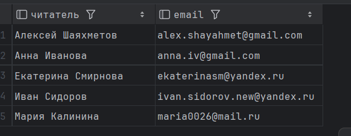

[2025-12-02 18:38:07] 5 rows retrieved starting from 1 in 208 ms (execution: 10 ms, fetching: 198 ms)

**LEFT JOIN:**

1 - Читатели и их штрафы: 
SELECT
r.name AS читатель,
f.amount AS сумма_штрафа,
f.status AS статус_штрафа
FROM Reader r
LEFT JOIN Fine f ON r.reader_id = f.reader_id
ORDER BY r.name;

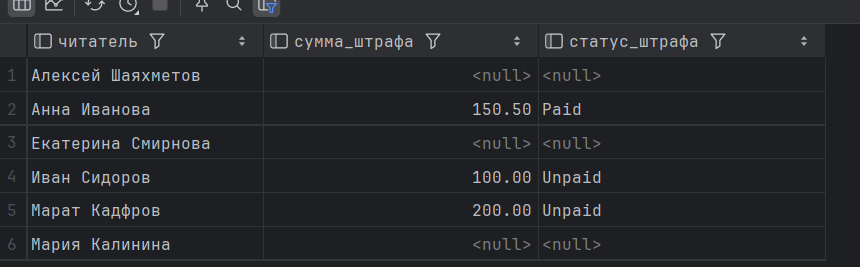

[2025-12-02 18:56:19] 6 rows retrieved starting from 1 in 337 ms (execution: 5 ms, fetching: 332 ms)

2 - Все читатели и их выдачи:
SELECT
r.name AS читатель,
b.title AS взятая_книга,
l.loan_date AS дата_выдачи
FROM Reader r
LEFT JOIN Loan l ON r.reader_id = l.reader_id
LEFT JOIN BookCopy bc ON l.copy_id = bc.copy_id
LEFT JOIN Book b ON bc.book_id = b.book_id
ORDER BY r.name;

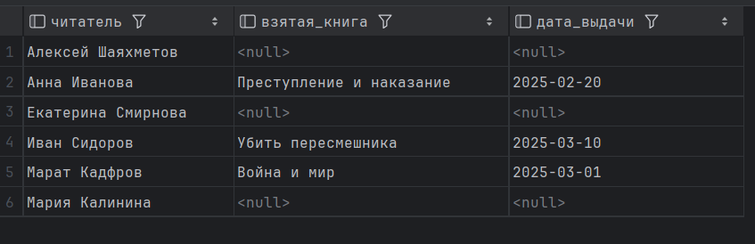

[2025-12-02 18:57:57] 6 rows retrieved starting from 1 in 353 ms (execution: 8 ms, fetching: 345 ms)

**RIGHT JOIN**

1 - Все авторы и их книги:
SELECT
a.name AS author_name,
b.title AS book_title
FROM Book b
RIGHT JOIN BookAuthor ba ON b.book_id = ba.book_id
RIGHT JOIN Author a ON ba.author_id = a.author_id
ORDER BY a.name;

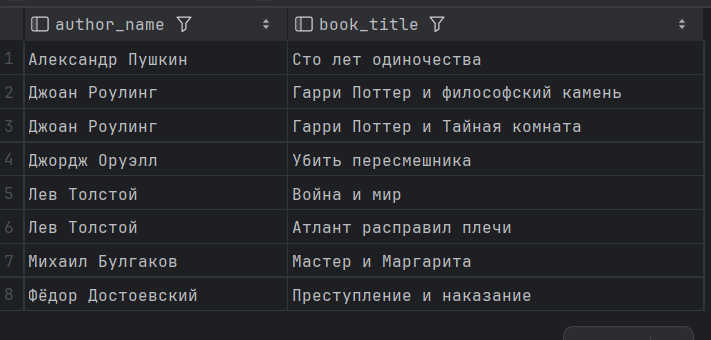

[2025-12-02 19:11:50] 8 rows retrieved starting from 1 in 135 ms (execution: 5 ms, fetching: 130 ms)

2 - Все книги и отзывы к ним:
SELECT
b.title,
rw.rating,
rw.comment
FROM Review rw
RIGHT JOIN Book b ON rw.book_id = b.book_id
ORDER BY b.title;

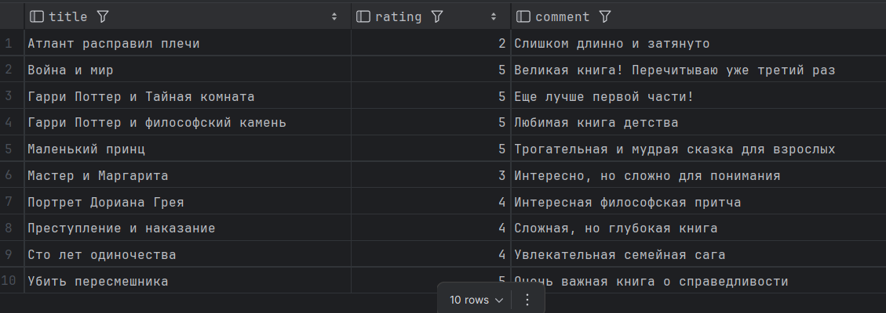

[2025-12-02 19:15:11] 10 rows retrieved starting from 1 in 194 ms (execution: 7 ms, fetching: 187 ms)

**FULL OUTER JOIN**

1 - Все жанры и связанные книги:
SELECT
g.name AS жанр,
b.title AS книга
FROM Genre g
FULL OUTER JOIN BookGenre bg ON g.genre_id = bg.genre_id
FULL OUTER JOIN Book b ON bg.book_id = b.book_id
ORDER BY g.name, b.title;

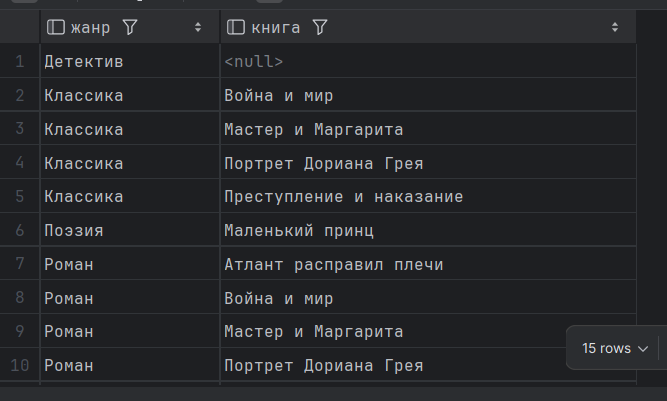

[2025-12-02 19:47:46] 15 rows retrieved starting from 1 in 71 ms (execution: 9 ms, fetching: 62 ms)

2 - Все издатели и их книги:
SELECT
p.name AS издатель,
b.title AS книга
FROM Publisher p
FULL OUTER JOIN Book b ON p.publisher_id = b.publisher_id
ORDER BY p.name, b.title;

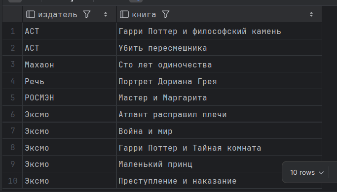

[2025-12-02 19:50:21] 10 rows retrieved starting from 1 in 276 ms (execution: 6 ms, fetching: 270 ms)

**CROSS JOIN**

1 - Все авторы и все жанры
SELECT
a.name AS автор,
g.name AS жанр
FROM Author a
CROSS JOIN Genre g
ORDER BY a.name, g.name;

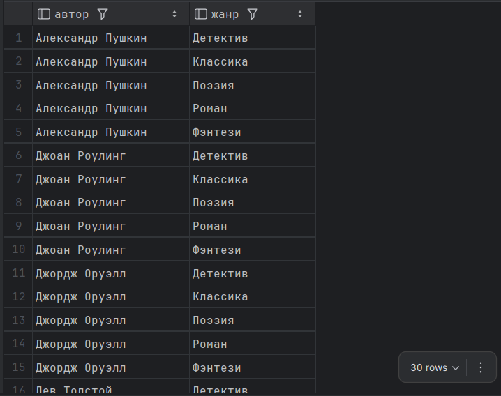

[2025-12-02 20:01:15] 30 rows retrieved starting from 1 in 150 ms (execution: 5 ms, fetching: 145 ms)

2 - Все комбинации статусов выдачи и резерваций
SELECT
copy_status.option AS book_status,
res_status.option AS reservation_status
FROM (VALUES ('Available'), ('Borrowed')) AS copy_status(option)
CROSS JOIN (VALUES ('Active'), ('Fulfilled')) AS res_status(option)
ORDER BY copy_status.option, res_status.option;

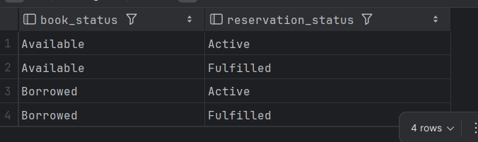

[2025-12-02 20:10:09] 4 rows retrieved starting from 1 in 70 ms (execution: 5 ms, fetching: 65 ms)
