//SELECT 
1. Сколько книг взял каждый читатель

`SELECT
name AS читатель,
(SELECT COUNT(*) FROM Loan WHERE reader_id = Reader.reader_id) AS сколько_книг_взял
FROM Reader;`

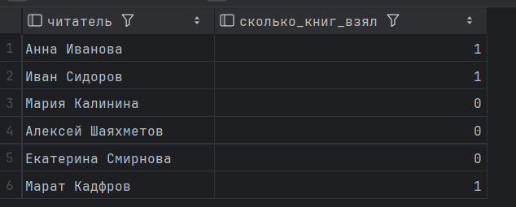

[2025-12-02 22:48:34] 6 rows retrieved starting from 1 in 176 ms (execution: 16 ms, fetching: 160 ms)

2. Средний рейтинг каждой книги

`SELECT
title AS книга,
(SELECT AVG(rating) FROM Review WHERE book_id = Book.book_id) AS средняя_оценка
FROM Book;`

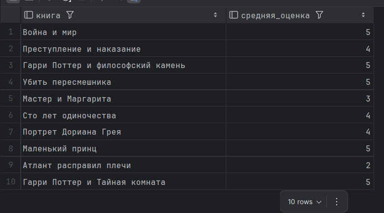

[2025-12-02 22:49:24] 10 rows retrieved starting from 1 in 161 ms (execution: 0 ms, fetching: 161 ms)

3. Сколько отзывов оставил каждый читатель

`SELECT
name AS читатель,
(SELECT COUNT(*) FROM Review WHERE reader_id = Reader.reader_id) AS сколько_отзывов_оставил
FROM Reader;`
   
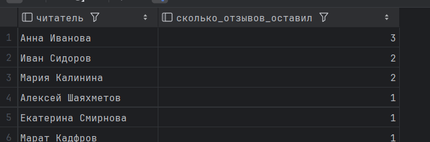

[2025-12-02 22:51:03] 6 rows retrieved starting from 1 in 84 ms (execution: 16 ms, fetching: 68 ms)

//FROM 
1. Книги с высокими оценками (выше 4 баллов)

`SELECT
книга,
оценка
FROM (
SELECT
title AS книга,
AVG(rating) AS оценка
FROM Book b
JOIN Review r ON b.book_id = r.book_id
GROUP BY title
) AS книги_с_оценками
WHERE оценка > 4;`

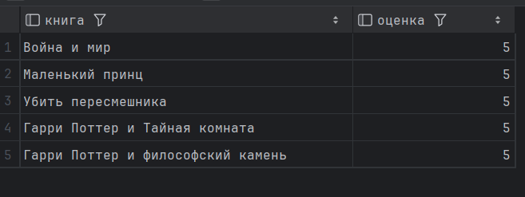

[2025-12-02 22:56:29] 5 rows retrieved starting from 1 in 48 ms (execution: 0 ms, fetching: 48 ms)

2. Активные читатели (те, кто брал книги)

`SELECT
читатель,
займов
FROM (
SELECT
name AS читатель,
COUNT(*) AS займов
FROM Reader r
JOIN Loan l ON r.reader_id = l.reader_id
GROUP BY name
) AS читатели_с_займами;`

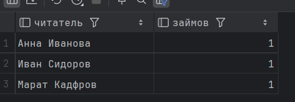

[2025-12-02 22:59:50] 3 rows retrieved starting from 1 in 65 ms (execution: 17 ms, fetching: 48 ms)

3. Авторы и количество их книг

`SELECT
автор,
книг
FROM (
SELECT
name AS автор,
COUNT(*) AS книг
FROM Author a
JOIN BookAuthor ba ON a.author_id = ba.author_id
GROUP BY name
) AS статистика_авторов;`

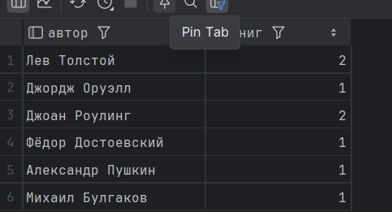

[2025-12-02 23:01:09] 6 rows retrieved starting from 1 in 223 ms (execution: 16 ms, fetching: 207 ms)

//WHERE 
1. Книги, на которые есть отзывы

`SELECT title AS книга
FROM Book
WHERE book_id IN (SELECT book_id FROM Review);`

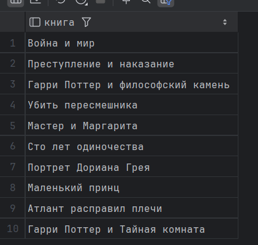

[2025-12-02 23:03:47] 10 rows retrieved starting from 1 in 286 ms (execution: 15 ms, fetching: 271 ms)

2. Читатели, у которых есть неоплаченные штрафы

`SELECT name AS читатель
FROM Reader
WHERE reader_id IN (SELECT reader_id FROM Fine WHERE status = 'Unpaid');`

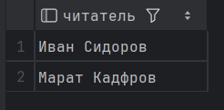

[2025-12-02 23:05:21] 2 rows retrieved starting from 1 in 192 ms (execution: 0 ms, fetching: 192 ms)

3. Современные книги (изданные после 2018 года)
`
SELECT title AS книга
FROM Book
WHERE book_id IN (SELECT book_id FROM Book WHERE publication_year > 2018);
`
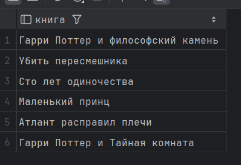

[2025-12-02 23:07:12] 6 rows retrieved starting from 1 in 245 ms (execution: 0 ms, fetching: 245 ms)

//HAVING
1. Книги с оценкой выше средней по всем книгам

`SELECT
title AS книга,
AVG(rating) AS средняя_оценка
FROM Book b
JOIN Review r ON b.book_id = r.book_id
GROUP BY title
HAVING AVG(rating) > (SELECT AVG(rating) FROM Review);`

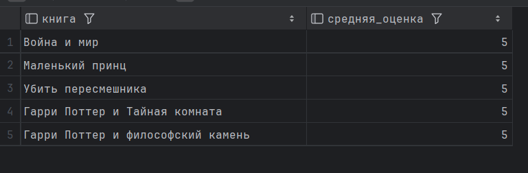

[2025-12-02 23:09:22] 5 rows retrieved starting from 1 in 80 ms (execution: 19 ms, fetching: 61 ms)

2. Читатели, которые брали книги

`SELECT
name AS читатель,
COUNT(*) AS сколько_раз_брал_книги
FROM Reader r
JOIN Loan l ON r.reader_id = l.reader_id
GROUP BY name
HAVING COUNT(*) > 0;`

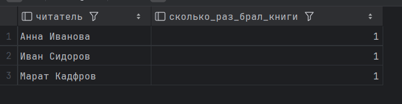

[2025-12-02 23:10:33] 3 rows retrieved starting from 1 in 67 ms (execution: 16 ms, fetching: 51 ms)

3. Популярные авторы (у которых есть книги)

`SELECT
name AS автор,
COUNT(*) AS сколько_книг
FROM Author a
JOIN BookAuthor ba ON a.author_id = ba.author_id
GROUP BY name
HAVING COUNT(*) > 0;`

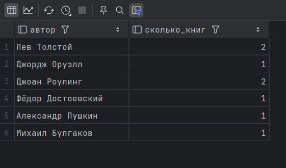

[2025-12-02 23:13:43] 6 rows retrieved starting from 1 in 48 ms (execution: 0 ms, fetching: 48 ms)

//ALL 
1. Самая старая книга в библиотеке

`SELECT title AS самая_старая_книга
FROM Book
WHERE publication_year <= ALL (SELECT publication_year FROM Book);`

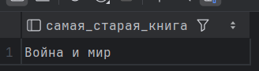

[2025-12-02 23:16:33] 1 row retrieved starting from 1 in 344 ms (execution: 4 ms, fetching: 340 ms)

2. Книга с наивысшим рейтингом

`SELECT title AS книга_с_наивысшим_рейтингом
FROM Book
WHERE book_id IN (
SELECT book_id
FROM Review
GROUP BY book_id
HAVING AVG(rating) >= ALL (
SELECT AVG(rating)
FROM Review
GROUP BY book_id
)
);`

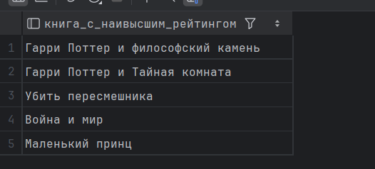

[2025-12-02 23:28:16] 5 rows retrieved starting from 1 in 178 ms (execution: 16 ms, fetching: 162 ms)

3. Самый молодой читатель

`SELECT name AS самый_молодой_читатель
FROM Reader
WHERE birth_date >= ALL (SELECT birth_date FROM Reader WHERE birth_date IS NOT NULL);`

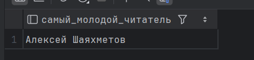

[2025-12-02 23:30:15] 1 row retrieved starting from 1 in 319 ms (execution: 6 ms, fetching: 313 ms)

//IN 
1. Книги в жанре "Роман"

`SELECT title AS книги_романы
FROM Book
WHERE book_id IN (
SELECT book_id
FROM BookGenre
WHERE genre_id = (SELECT genre_id FROM Genre WHERE name = 'Роман')
);`

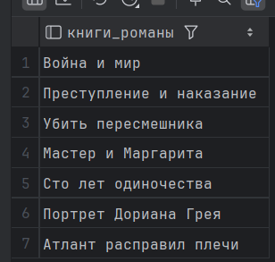

[2025-12-02 23:32:18] 7 rows retrieved starting from 1 in 73 ms (execution: 0 ms, fetching: 73 ms)

2. Читатели из города Казань

`SELECT name AS читатели_из_Казани
FROM Reader
WHERE reader_id IN (
    SELECT reader_id
    FROM Reader
    WHERE address_id IN (SELECT address_id FROM address WHERE city LIKE '%Казань%')
);`

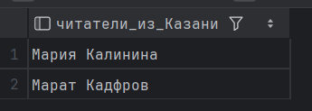

[2025-12-02 23:49:18] 2 rows retrieved starting from 1 in 332 ms (execution: 7 ms, fetching: 325 ms

3. Книги издательства "Эксмо"

`SELECT title AS книги_издательства_Эксмо
FROM Book
WHERE publisher_id IN (
SELECT publisher_id
FROM Publisher
WHERE name = 'Эксмо'
);`

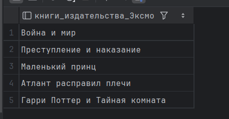

[2025-12-02 23:42:44] 5 rows retrieved starting from 1 in 258 ms (execution: 13 ms, fetching: 245 ms)

//ANY 
1. Книги с хорошими отзывами (оценка выше 4)

`SELECT title AS книги_с_хорошими_отзывами
FROM Book
WHERE book_id IN (
SELECT book_id
FROM Review
GROUP BY book_id
HAVING AVG(rating) > ANY (SELECT 4)
);`

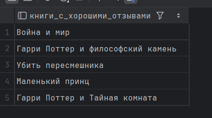

[2025-12-02 23:51:39] 5 rows retrieved starting from 1 in 299 ms (execution: 9 ms, fetching: 290 ms)

2. Активные читатели (те, кто брал книги)

`SELECT name AS активные_читатели
FROM Reader
WHERE reader_id = ANY (SELECT reader_id FROM Loan);`

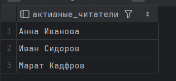

3. Объемные книги (более 500 страниц)

`SELECT title AS объемные_книги
FROM Book
WHERE pages > ANY (SELECT 500);`

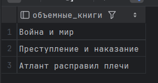

//EXISTS 
1. Читатели, которые оставляли отзывы

`SELECT name AS читатели_с_отзывами
FROM Reader r
WHERE EXISTS (SELECT 1 FROM Review WHERE reader_id = r.reader_id);`

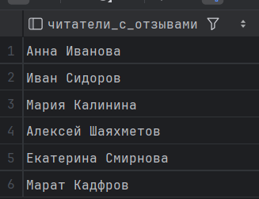

2. Книги, которые сейчас выданы читателям

`SELECT title AS книги_в_займе
FROM Book b
WHERE EXISTS (
SELECT 1
FROM BookCopy bc
JOIN Loan l ON bc.copy_id = l.copy_id
WHERE bc.book_id = b.book_id
);`

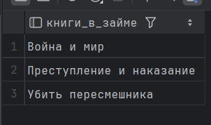

3. Авторы, чьи книги есть в библиотеке

`SELECT name AS авторы_с_книгами
FROM Author a
WHERE EXISTS (SELECT 1 FROM BookAuthor WHERE author_id = a.author_id);`

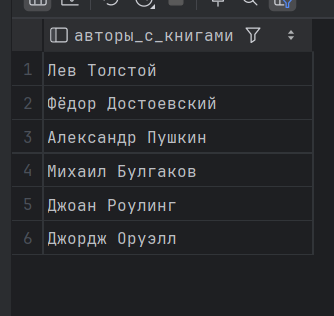

//Сравнение по нескольким столбцам
1. Читатели, зарегистрированные в тот же день и по тому же адресу, что и Анна Иванова

`SELECT name AS такие_же_как_Анна_Иванова
FROM Reader
WHERE (registration_date, address) = (
SELECT registration_date, address
FROM Reader
WHERE name = 'Анна Иванова'
);`

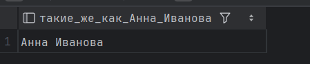

2. Книги, изданные в тот же год и тем же издателем, как "Гарри Поттер и Тайная комната"

`SELECT title AS похожие_на_Гарри_Поттер_и_Тайная_комната
FROM Book
WHERE (publication_year, publisher_id) = (
    SELECT publication_year, publisher_id
    FROM Book
    WHERE title = 'Гарри Поттер и Тайная комната'
);`

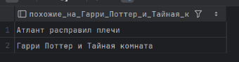

3. Книги с одним и тем же жанром и издателем

`SELECT
b1.title AS первая_книга,
b2.title AS вторая_книга
FROM Book b1
JOIN Book b2 ON b1.book_id < b2.book_id
WHERE b1.publisher_id = b2.publisher_id
AND EXISTS (
SELECT 1
FROM BookGenre bg1
JOIN BookGenre bg2 ON bg1.genre_id = bg2.genre_id
WHERE bg1.book_id = b1.book_id
AND bg2.book_id = b2.book_id
);`

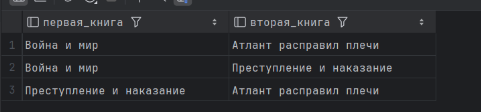

//Коррелированные подзапросы
1. Читатели, которые брали книги

`SELECT
name AS читатель,
(SELECT COUNT(*) FROM Loan WHERE reader_id = Reader.reader_id) AS сколько_книг_взял
FROM Reader
WHERE (SELECT COUNT(*) FROM Loan WHERE reader_id = Reader.reader_id) > 0;`

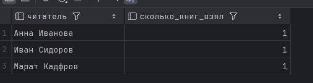

2. Книги с отзывами

`SELECT
title AS книга,
(SELECT AVG(rating) FROM Review WHERE book_id = Book.book_id) AS средняя_оценка
FROM Book
WHERE (SELECT COUNT(*) FROM Review WHERE book_id = Book.book_id) > 0;
`
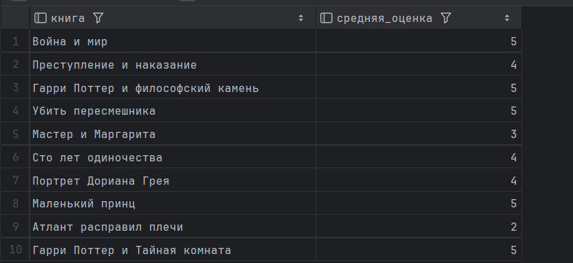

3. Авторы с книгами в библиотеке

`SELECT
name AS автор,
(SELECT COUNT(*) FROM BookAuthor WHERE author_id = Author.author_id) AS сколько_книг
FROM Author
WHERE (SELECT COUNT(*) FROM BookAuthor WHERE author_id = Author.author_id) > 0;`

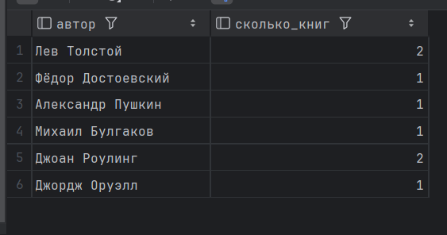

4. Книги на полках категории A

`SELECT
title AS книги_на_полках_А
FROM Book b1
WHERE shelf_location LIKE 'A%'
AND (SELECT COUNT(*) FROM Book WHERE shelf_location = b1.shelf_location) >= 1;`

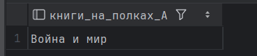

5. Читатели с неоплаченными штрафами

`SELECT
name AS читатели_с_неоплаченными_штрафами
FROM Reader r
WHERE EXISTS (
SELECT 1
FROM Fine
WHERE reader_id = r.reader_id
AND status = 'Unpaid'
);`

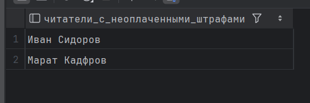
